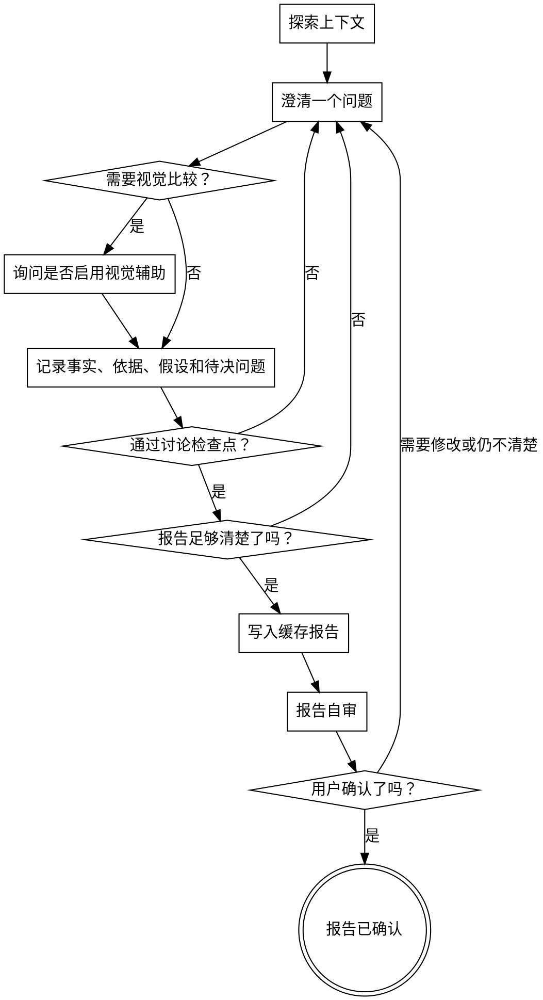

# 头脑风暴

把模糊想法整理成一份用户确认过的头脑风暴报告。报告记录目标、上下文、依据、候选方向、假设和待决问题；它不是后续工作的承诺，也不替用户进入下一阶段。

<HARD-GATE>
写入任何缓存报告前，必须先通过讨论检查点：用户已经在本次头脑风暴中回答过至少一个澄清问题，或用户明确要求跳过讨论、直接根据已提供材料生成报告。

头脑风暴报告被用户确认前，不调用任何其他 skill。
</HARD-GATE>

## 反模式：“这个太简单，不需要头脑风暴”

每个需要继续推进的想法都至少要确认目标、边界和判断依据。简单想法可以用很短的报告，但不能跳过确认；越小的事项越容易因为默认假设不同而做偏。

## 反模式：“先缓存报告”

缓存报告是讨论产物，不是开场动作。进入本 skill 后，第一条面向用户的回复应询问当前最重要的澄清问题；只有用户明确要求跳过讨论并根据已提供材料生成报告时，才直接写缓存报告。

## 流程图

## 输出位置

通过讨论检查点且报告已足够清楚后，头脑风暴报告优先写入系统缓存目录；如果当前环境无法确定或无法写入系统缓存目录，则写入仓库内的本地缓存目录。

规则：

- 如果目标目录不存在，先创建目录。
- `<repo-slug>` 使用当前仓库目录名。
- `<topic-slug>` 使用简短英文、数字和连字符；无法确定时用当前主题关键词拼音或日期。
- 每次更新同一场头脑风暴时，覆盖同一个报告文件。
- 交付时同时给出实际报告路径和报告正文摘要。
- 缓存报告不是长期项目事实；不要写入 `docs/`。

## 流程

按顺序完成：

1. **探索必要上下文**：只读取判断当前想法需要的文件、文档或事实来源。完成标准：能说明已读取的上下文支撑了哪些判断。
2. **确认入口**：确认用户是在做头脑风暴、想法探索或模糊问题澄清。完成标准：没有把对话带入其他 skill。
3. **澄清目标与边界**：一次只问一个问题；多选能降低回答成本时优先多选。完成标准：用户已回答当前最重要的澄清问题，或答案已记录为待决。
4. **通过讨论检查点**：确认用户已在本次头脑风暴中回答过至少一个澄清问题，或明确要求跳过讨论并根据已提供材料生成报告。完成标准：检查点允许写入缓存报告。
5. **记录事实分层**：把已确认事实、依据、假设和待决问题分开。完成标准：没有把推断写成已确认事实。
6. **整理候选方向**：把用户给出的命令名、技术路径、文件格式或流程建议转写成候选方向；只有用户明确说不可变时才写入约束。完成标准：方案输入没有被伪装成已确认结论。
7. **写入缓存报告**：通过讨论检查点后，读取 `references/report-artifacts.md` 并按其中模板写入报告；优先写入系统缓存目录，如果当前环境无法确定或无法写入系统缓存目录，则写入仓库内的本地缓存目录。完成标准：文件存在，且内容覆盖目标、背景、依据、候选方向、假设和待决问题。
8. **报告自审**：使用 `references/report-artifacts.md` 检查报告是否清楚、可追溯、待决透明。完成标准：自审发现的问题已直接修正，或明确留在待决问题中。
9. **用户确认**：展示报告路径和正文摘要，请用户确认、修改或继续澄清。完成标准：用户明确确认，或给出下一轮澄清输入。

## 视觉辅助

只有当视觉方式明显比文字更适合澄清当前想法时，才询问是否启用视觉辅助。适用场景包括 UI 草图、布局比较、导航结构、状态流、信息架构、视觉层级或交互路径选择。

用户同意后，读取同目录的 `visual-companion.md` 并按其流程执行。视觉反馈必须转写回头脑风暴报告；草图或点击选择本身不是最终报告。

## 核心原则

- 一次只问一个问题。
- 先提问，再缓存；只有通过讨论检查点后才写缓存报告。
- 先形成可确认的头脑风暴报告。
- 头脑风暴报告确认前，不调用任何其他 skill。
- 已确认事实、依据、假设和待决问题必须保持分离。
- 缓存报告用于当前协作，不是长期项目事实。
