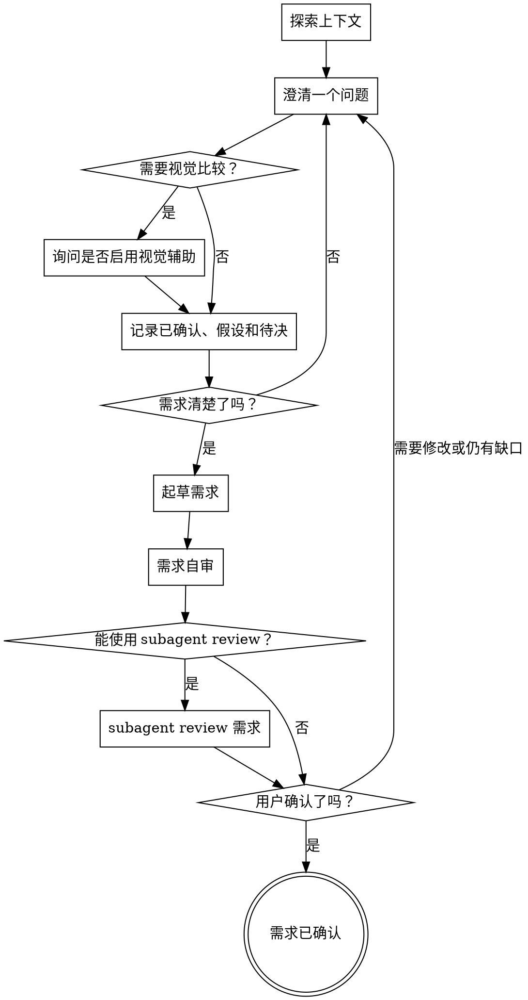

# 需求头脑风暴

把模糊想法转成用户确认过的需求正文。这个 skill 的终点是需求草稿被确认，不是 spec、plan、设计文档、任务拆分或实现。

<HARD-GATE>
用户确认需求前，不要调用实现类 skill、写代码、创建 spec、创建 plan、拆任务或做实现动作。需求确认后也不要自动进入下一阶段，只等待用户决定。
</HARD-GATE>

## 反模式：“这个太简单，不需要讨论需求”

每个需要被落实的想法都至少要确认目标、范围和验收边界。简单需求可以用很短的正文，但不能跳过确认；越小的改动越容易因为默认假设不同而做偏。

## 检查清单

按顺序完成：

1. **探索必要上下文**：只读取与需求判断有关的文件、文档或事实来源。
2. **确认需求入口**：确认用户是在头脑风暴、讨论需求、澄清需求，且没有显式调用更具体的 skill。
3. **澄清目标与边界**：一次问一个问题，优先多选，围绕目标、用户、范围、非范围、约束和成功标准。
4. **整理已确认/假设/待决**：不要把假设混进已确认需求。
5. **处理方案输入**：用户给出命令名、技术方案、文件格式或实现路径时，先转写成需求候选；只有用户明确指定不可变时才记为约束。
6. **按需使用视觉辅助**：只有当前问题需要看图判断时才询问是否启用 visual companion。
7. **输出需求草稿**：覆盖目标、范围、功能需求、验收场景、成功标准和待决问题。
8. **需求自审**：检查可测试、可衡量、无实现泄漏、待决透明。
9. **Subagent review**：自审通过后，如果当前环境可用且授权边界允许，自动调用 subagent review 需求质量。
10. **用户确认**：让用户确认、修改或继续澄清。

## 流程图



## 流程说明

**理解需求**

- 从问题和用户价值出发，而不是从解决方案出发。
- 识别谁受影响、需要什么结果，以及什么算成功。
- 如果请求包含多个独立需求，先指出这一点，并帮助用户选择第一个要澄清的需求。
- 如果当前文件或事实会影响判断，只读取需求判断所需的最小上下文。

**澄清需求**

- 每条消息只问一个问题。
- 多选能帮助用户快速回答时，优先使用多选。
- 有帮助时，显式维护三类信息：已确认、假设、待决问题。
- 不要虚构会影响范围、契约、用户行为或验收的事实。

**处理用户提出的方案**

- 把用户给出的实现细节当成需要判断的输入，不要自动当成最终需求。
- 把“用 YAML + git clone 做 projects prepare”转写成需求语言，例如“维护者需要一条可重复执行的项目工作副本准备入口”。
- 如果用户明确说某个细节是必需的，把它记录到约束中。

## 需求草稿

默认使用以下结构。简单需求可以合并章节，但要保留对应含义：

```markdown
## 目标

## 背景

## 范围

## 非范围

## 用户与场景

## 功能需求

## 约束

## 验收场景

## 成功标准

## 假设与依赖

## 待决问题
```

写法规则：

- `目标` 说明用户价值和期望结果。
- `范围` 和 `非范围` 说明包含什么、不包含什么。
- `功能需求` 描述可观察行为，不写架构、API、数据模型或任务。
- `验收场景` 用 Given/When/Then 或等价清晰表述覆盖主流程、异常流程和边界流程。
- `成功标准` 必须可衡量，并尽量与技术无关。
- `待决问题` 只包含真实未决点；阻塞问题必须在确认前继续澄清。

## 需求自审

请用户确认前，先检查：

| 检查项 | 标准 |
| --- | --- |
| 用户价值 | 问题和期望结果清楚 |
| 范围 | 包含和不包含的内容明确 |
| 可测试性 | 关键需求有验收场景 |
| 可衡量性 | 成功标准可观察 |
| 无实现泄漏 | 没有把方案伪装成需求 |
| 待决透明 | 未确认事实清晰可见 |

展示草稿前，直接修正文档中的问题。

## Subagent Review

自审通过后，如果当前环境提供 subagent 且授权边界允许，自动调用 subagent review 需求正文，不把它作为用户选项。调用时使用 `reviewer-prompt.md` 里的需求 review 模板。

review 只检查需求质量：范围是否清楚、验收是否可测试、成功标准是否可衡量、是否混入实现方案、待决问题是否透明。不要让 subagent 写 spec、plan、任务或实现建议。

如果 subagent 不可用或当前工具策略要求先取得用户授权，跳过自动 review，并在展示需求草稿时简短说明跳过原因。

## 用户确认门禁

自审和可用的 subagent review 完成后，展示需求草稿，并请用户确认、修改或继续澄清。用户确认后，只说明需求已确认，然后等待用户下一步指示。

## 视觉辅助

只有当某个需求问题用视觉方式比文字更清楚时，才使用 `visual-companion.md`。

适用场景包括 UI mockup、布局比较、导航结构、状态流、信息架构、视觉层级或交互路径选择。普通范围、优先级、角色、概念或验收问题不使用它。

只在需要时单独询问是否启用。用户同意后，先读取 `visual-companion.md`，再启动视觉辅助。视觉反馈必须转写回需求正文；mockup 或点击选项本身不是最终需求。

## 核心原则

- 一次只问一个问题。
- 先确认需求，再讨论方案。
- 已确认事实、假设和待决问题必须保持分离。
- 视觉辅助用于澄清需求，不能替代需求文字。
- 除非用户明确要求下一阶段，否则停在需求确认。
