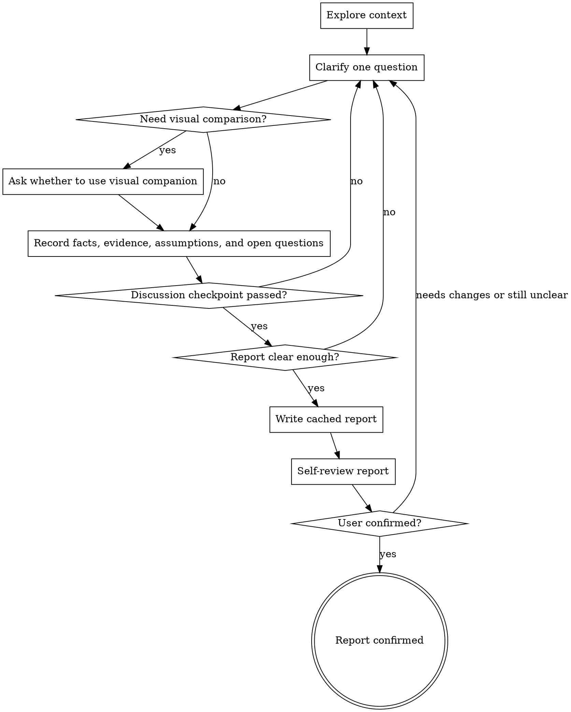

# Brainstorming

Turn a fuzzy idea into a user-confirmed brainstorming report. The report records the goal, context, evidence, candidate directions, assumptions, and open questions. It is not a commitment to later work and does not move the user into another stage.

<HARD-GATE>
Before writing any cached report, pass the discussion checkpoint: the user has answered at least one clarifying question in this brainstorming session, or the user explicitly asks to skip discussion and create the report from the provided material.

Do not invoke any other skill before the user confirms the brainstorming report.
</HARD-GATE>

## Anti-Pattern: "This Is Too Simple To Brainstorm"

Every idea that may move forward needs at least a confirmed goal, boundary, and basis for judgment. A simple idea can have a short report, but it still needs confirmation; small items are easy to skew through mismatched default assumptions.

## Anti-Pattern: "Cache The Report First"

A cached report is an artifact from the discussion, not the opening move. After entering this skill, the first user-facing response asks the most important clarifying question unless the user explicitly asks to skip discussion and create the report from the material already provided.

## Process Diagram



## Output Location

After the discussion checkpoint passes and the report is clear enough, write the brainstorming report to the system cache directory first. If the current environment cannot determine or write to the system cache directory, write it to a local cache directory inside the repository.

Rules:

- Create the target directory if it does not exist.
- Use the current repository directory name as `<repo-slug>`.
- Use short lowercase English words, digits, and hyphens for `<topic-slug>`; if uncertain, use pinyin from the current topic keywords or a date.
- Overwrite the same report file when updating the same brainstorming session.
- In the delivery message, include the actual report path and a summary of the report body.
- A cached report is not long-lived project fact; do not write it to `docs/`.

## Workflow

Follow these steps in order:

1. **Explore necessary context**: Read only the files, docs, or facts needed to judge the current idea. Completion criterion: you can explain which context supports which judgment.
2. **Confirm the entry point**: Confirm the user is brainstorming, exploring an idea, or clarifying a fuzzy request. Completion criterion: you have not moved the conversation into another skill.
3. **Clarify goal and boundary**: Ask one question at a time; prefer multiple choice when it lowers user effort. Completion criterion: the user has answered the most important current clarifying question, or the answer has been recorded as open.
4. **Pass the discussion checkpoint**: Confirm the user has answered at least one clarifying question in this brainstorming session, or explicitly asked to skip discussion and create the report from the provided material. Completion criterion: cached report writing is allowed by the checkpoint.
5. **Separate fact layers**: Keep confirmed facts, evidence, assumptions, and open questions separate. Completion criterion: no inference is written as a confirmed fact.
6. **Organize candidate directions**: Rewrite command names, technical paths, file formats, or process suggestions from the user as candidate directions; record them as constraints only when the user explicitly makes them non-negotiable. Completion criterion: solution input is not disguised as a confirmed conclusion.
7. **Write the cached report**: Write the report from the template after the discussion checkpoint passes; use the system cache directory first, or a local cache directory inside the repository when needed. Completion criterion: the file exists and covers the goal, background, evidence, candidate directions, assumptions, and open questions.
8. **Self-review the report**: Check that the report is clear, traceable, and transparent about open questions. Completion criterion: issues found during review are fixed or explicitly kept as open questions.
9. **Ask for user confirmation**: Show the report path and body summary, then ask the user to confirm, revise, or continue clarifying. Completion criterion: the user explicitly confirms or provides the next clarification input.

## Report Template

Write the report body with Chinese section headings by default. Use this structure unless the user explicitly asks for another language:

```markdown
# <主题>

## 背景

## 用户目标

## 已确认事实

## 依据与参考

## 候选方向

## 范围候选

## 非范围候选

## 假设与待决
```

## Writing Rules

- `背景` explains where the idea came from and why it is being discussed now.
- `用户目标` explains the outcome and value the user wants.
- `已确认事实` includes only user-confirmed facts, explicit project documentation, or facts directly supported by a source.
- `依据与参考` records only sources that affect boundaries, constraints, or judgments; prefer official external documentation and state which judgment each source supports.
- `候选方向` records possible paths without turning them into conclusions.
- `范围候选` and `非范围候选` explain what may be included or excluded.
- `假设与待决` records premises that are not yet confirmed and real unresolved questions. Questions that block report confirmation must be clarified.

## Self-Review Checklist

Check each item before asking the user to confirm:

| Check | Standard |
| --- | --- |
| Clear goal | It is clear what the user wants to solve and what result they want |
| Fact layering | Confirmed facts, evidence, assumptions, and open questions are not mixed |
| Traceable sources | Key judgments trace back to user input, project docs, or external docs |
| Transparent candidates | Candidate directions are not written as fixed conclusions |
| Discussable boundary | Scope and out-of-scope candidates are enough for the user to choose |
| Transparent open questions | Unconfirmed facts are visible and not hidden |

## Visual Companion

Ask whether to use the visual companion only when visual work is clearly better than text for clarifying the current idea. Suitable cases include UI sketches, layout comparisons, navigation structures, state flows, information architecture, visual hierarchy, or interaction path choices.

After the user agrees, read `visual-companion.md` in this directory and follow its process. Visual feedback must be rewritten into the brainstorming report; sketches or click choices are not the final report.

## Core Principles

- Ask one question at a time.
- Ask before caching; cache only after the discussion checkpoint passes.
- Form a confirmable brainstorming report first.
- Do not invoke any other skill before the brainstorming report is confirmed.
- Keep confirmed facts, evidence, assumptions, and open questions separate.
- Use the cached report for current collaboration; it is not long-lived project fact.
