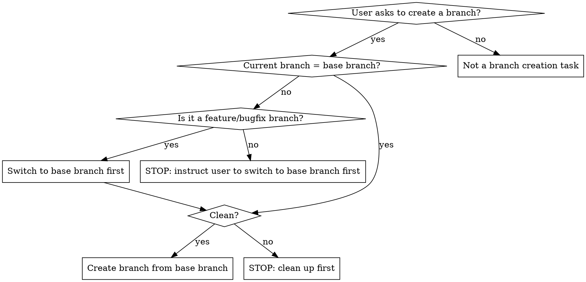

# Git Branch Creator

## Overview

Create git branches following the GitLab workflow convention. Every new branch MUST branch from the **base branch** (`main`, `master`, or a branch the user specifies). Use `feature/` prefix for new capabilities and `bugfix/` prefix for fixes.

**Core principle:** Never create a branch from a non-base branch. If the current branch is not the base branch, STOP — do not proceed.

## When to Create a Branch



## Base Branch Detection (REQUIRED — do not skip)

Before anything else, determine the base branch:

1. **User explicitly specifies a base branch**: Use it. Example: "create a feature branch from `master`" → base branch is `master`.
2. **Check git remote HEAD**: Run `git remote show origin 2>/dev/null | grep 'HEAD branch' | awk '{print $NF}'`. If it returns `main`, `master`, or another branch name, use that.
3. **Fall back to local branches**: If step 2 fails (no remote), check which of `main` or `master` exists locally:

   ```bash
   git branch --list main --list master
   ```

   - If only `main` exists → base branch is `main`
   - If only `master` exists → base branch is `master`
   - If both exist, prefer `main`
   - If neither exists, ask the user which branch to use as base.

4. **Always confirm with the user**: "Base branch: `<name>`. Create branch from here?"

## Precondition Checks (REQUIRED — do not skip)

Before creating any branch, execute these checks in order:

### 1. Verify current branch IS the base branch

```bash
git branch --show-current
```

- **If output matches the base branch**: proceed to step 2.
- **If output is `feature/*` or `bugfix/*`**: This is a valid implementation branch but NOT where you create new branches. Switch to the base branch first:
  ```
  git checkout <base-branch>
  ```
  Then re-run step 1 to confirm before proceeding.
- **If output is anything else** (experiment, wip, temp, hotfix, etc.): **STOP immediately.** Tell the user:
  ```
  Current branch is `<branch-name>`, not `<base-branch>`. Please switch to <base-branch> first:
    git checkout <base-branch>
  Then I can create the new branch.
  ```

### 2. Verify working tree is clean

```bash
git status --porcelain
```

- **If output is empty**: proceed to step 3.
- **If output is NOT empty** (ANY output — including `??` untracked files, `M` modified, `A` staged): **STOP.** Tell the user:
  ```
  Working tree has uncommitted changes. Please commit or stash them first:
    git stash  (to save temporarily)
    git commit -m "..."  (to commit)
  ```

### 3. Sync with remote (optional but recommended)

```bash
git fetch origin <base-branch>
```

If there are new commits on `origin/<base-branch>`, warn the user before branching.

## Naming Convention (GitLab Workflow)

```
<type>/<short-description>
```

| Type       | Use When                                  | Example                                               |
| ---------- | ----------------------------------------- | ----------------------------------------------------- |
| `feature/` | New capability, enhancement, backlog item | `feature/oauth-login`, `feature/api-rate-limiting`    |
| `bugfix/`  | Bug fix, defect correction                | `bugfix/login-timeout`, `bugfix/null-pointer-payment` |

**Rules for the description part:**

- Use lowercase letters, numbers, and hyphens only
- Keep it short and descriptive (3-5 words max)
- Use hyphens as word separators (no underscores, no camelCase)
- Derive from the backlog item title, spec summary, or user's description
- Remove articles (a, an, the) and filler words

### Examples

| Input                            | Branch Name                         |
| -------------------------------- | ----------------------------------- |
| "user authentication with OAuth" | `feature/user-authentication-oauth` |
| "fix the login timeout bug"      | `bugfix/login-timeout`              |
| "API rate limiting middleware"   | `feature/api-rate-limiting`         |
| "payment integration"            | `feature/payment-integration`       |

## Quick Reference

```bash
# 0. Determine base branch
git remote show origin 2>/dev/null | grep 'HEAD branch' | awk '{print $NF}'
# or: git branch --list main --list master

# 1. Verify preconditions
git branch --show-current     # MUST be the base branch
git status --porcelain        # MUST be empty

# 2. Create and switch to new branch
git checkout -b feature/<description>
# or
git checkout -b bugfix/<description>

# 3. Confirm
git branch --show-current
```

## Common Mistakes

| Mistake                             | Why It's Wrong                                    | Correct                                         |
| ----------------------------------- | ------------------------------------------------- | ----------------------------------------------- |
| Branching from a feature branch     | Creates dependency chain, harder to review/rebase | Always branch from the base branch              |
| Using `fix/` prefix                 | Not aligned with GitLab workflow (`bugfix/`)      | Use `bugfix/`                                   |
| Using underscores in name           | Breaks convention, inconsistent                   | Use hyphens: `feature/oauth-login`              |
| Skipping `git status` check         | Stashes or WIP get mixed into new branch          | Always check working tree is clean              |
| Creating branch from `experiment/*` | Experiment branches are not stable bases          | Stop and instruct user to switch to base branch |
| Assuming base branch is `main`      | Some repos use `master` or a custom default       | Always detect the base branch first             |

## Red Flags — STOP and Re-check

- You're about to run `git checkout -b` without first running `git branch --show-current`
- You're on a `feature/*` or `bugfix/*` branch and about to create another branch without switching to the base branch first
- You're on `experiment/*`, `wip/*`, or any branch without `feature/` or `bugfix/` prefix and about to create a branch
- `git status --porcelain` shows ANY output — even `??` for untracked files is NOT clean
- The user said "quick" or "urgent" — pressure is high, mistakes happen here
- You're about to use `fix/` instead of `bugfix/` because "it's shorter"
- You're about to use underscores or camelCase in the branch name
- You didn't confirm the base branch with the user

**All of these mean: Run the precondition checks. Do not skip them.**

## Rationalization Table

| Excuse                                                        | Reality                                                                     |
| ------------------------------------------------------------- | --------------------------------------------------------------------------- |
| "I'm already on a feature branch, I'll just branch from here" | Creates dependency chains. Branch from the base branch.                     |
| "The user is in a hurry, I'll skip the checks"                | Pressure is when mistakes happen. Checks take 2 seconds.                    |
| "This repo might use a different convention"                  | Unless a CLAUDE.md or CONTRIBUTING.md overrides it, use GitLab convention.  |
| "Branching from current branch is faster"                     | Faster now, painful later during rebase/review. Always use the base branch. |
| "It's just a small change, naming doesn't matter"             | Consistent naming helps the whole team find branches.                       |
| "Untracked files don't count as dirty"                        | `git status --porcelain` shows `??` — any output means STOP.                |
| "I'll just use `fix/` instead of `bugfix/` — it's shorter"    | GitLab uses `bugfix/`. Consistency > brevity.                               |
| "The base branch is probably main"                            | Always detect and confirm. Never assume.                                    |
